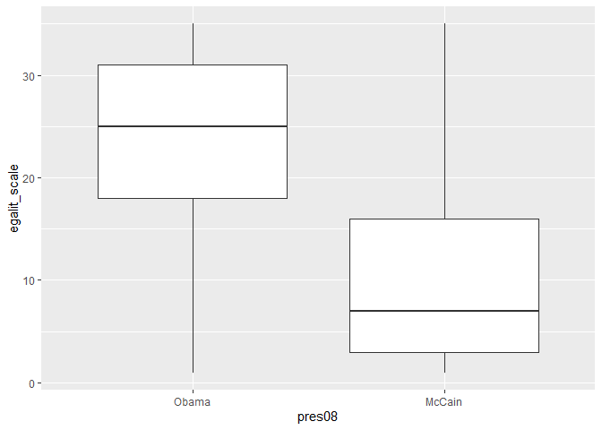

Aula Markdown
================
Rodrigo Martins
7/14/2020

## Aqui com essas duas hashtags, sinalizamos o título de um tópico/sessão

O documento em rmarkdown começa com algumas especificações sobre as
propriedades do documento, utilizando “—” para delimitar o começo e o
fim de tais propriedades. O padrão é especificar o título com o
argumento `title`, o autor com o argumento `author`, a data com o
argumento `date` e o tipo de formato que o arquivo terá em sua versão
final, com o argumento `output`. Existem diversos outros argumentos
adicionais que podemos espeficiar.

Em seguida, é especificado como o código em markdown, de maneira geral,
vai lidar com os códigos de R que utilizarmos ao longo do documento.
Podemos deixar o padrão já pré-estabelecido.

Quando clicamos no botão **knit**, o documento será gerado, salvando
tanto o código em markdown quanto o formato final.

Para rodar algum código em R, utilizamos os seguintes parâmetros para
especificar o começo e o fim de um bloco com código de ` ```{r} ` em uma
nova linha e o final com ` ``` `, também em uma nova linha. Desta forma,
tudo o que estiver entre essas duas delimitações será entendido como um
código de R normal.

Para incluir um gráfico ao documento, basta criá-lo dentro do código em
R. O gráfico criado é exibido automaticamente quando geramos o
documento, junto com o código que o criou.

Tudo o que é gerado nestes códigos, por padrão, também será exibido no
documento final, como no exemplo abaixo

``` r
library(tidyverse)
```

    ## -- Attaching packages --------------------------------------------- tidyverse 1.3.0 --

    ## v ggplot2 3.3.1     v purrr   0.3.4
    ## v tibble  3.0.1     v dplyr   1.0.0
    ## v tidyr   1.1.0     v stringr 1.4.0
    ## v readr   1.3.1     v forcats 0.5.0

    ## -- Conflicts ------------------------------------------------ tidyverse_conflicts() --
    ## x dplyr::filter() masks stats::filter()
    ## x dplyr::lag()    masks stats::lag()

``` r
library(poliscidata)

banco <- gss %>%
  filter(!is.na(pres08),
         !is.na(black))

ggplot(banco, aes(pres08, egalit_scale)) +
  geom_boxplot()
```

    ## Warning: Removed 394 rows containing non-finite values (stat_boxplot).

<!-- -->

Podemos fazer com que apareça apenas o gráfico, sem os códigos, ao
especificarmos o argumento `echo = FALSE` dentro das chaves que abre o
bloco de código de R, ` ```{r, echo = FALSE} `. A mensagem de *warning*
também pode ser suprimida com o argumento `warning = FALSE`. Quando
carregamos os pacotes, surgiram diversas mensagens que não são
*warnings*. Para não exibi-las, usamos o argumento `message = FALSE`.

Para gerar um documento em markdown que seja exibido no github, é
necessário especificar o argumento output da seguinte maneira:

\`\`\` output:
